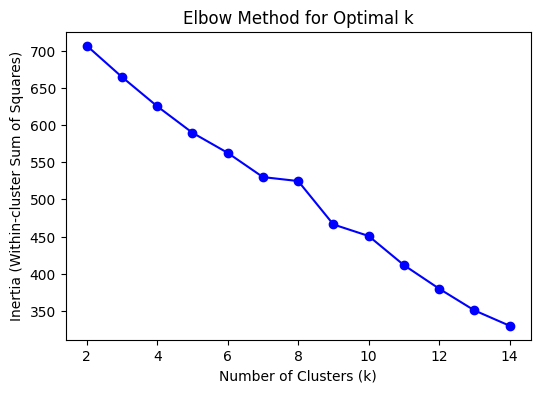
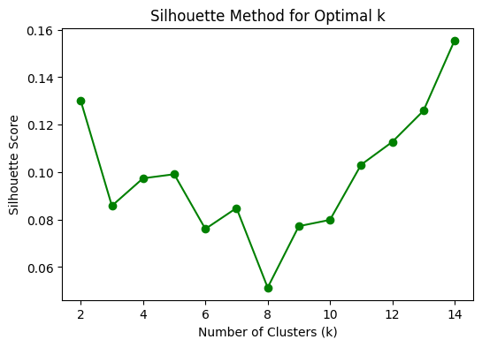
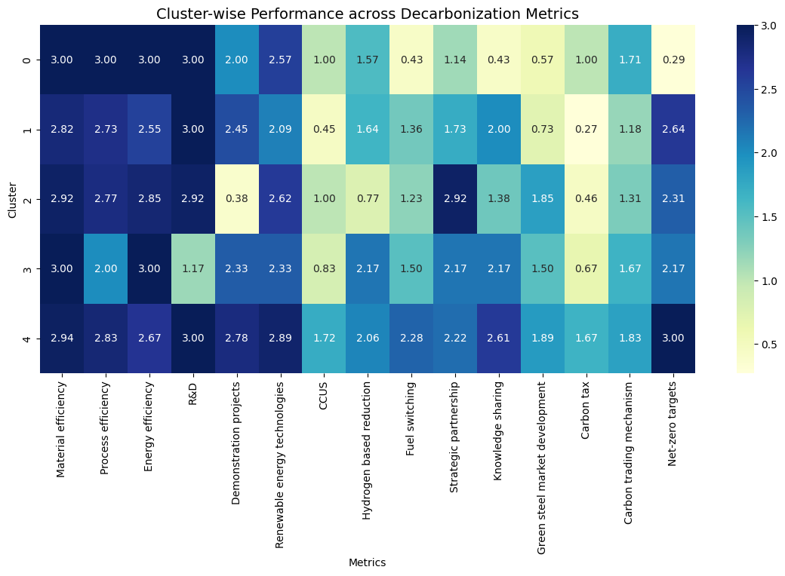
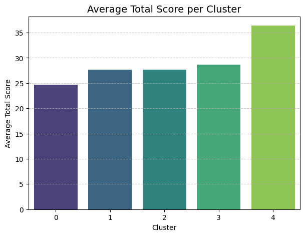
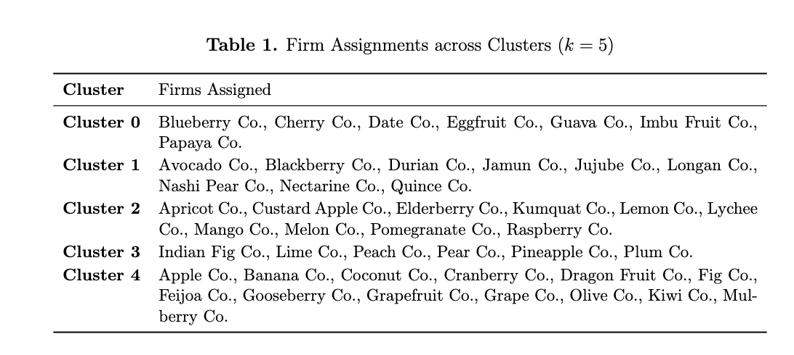

# 🌍 MBA627 Individual Assignment — Cluster Analysis on Corporate Decarbonization Strategies

### 📄 Overview
This repository contains the code, dataset, and visual outputs for the MBA627 Individual Assignment titled **“Cluster Analysis on Corporate Decarbonization Strategies.”**  
The analysis applies **K-Means clustering** to segment 55 industrial firms based on their engagement in decarbonization actions such as energy efficiency, R&D, renewable technology adoption, and policy alignment.

---

## 🧠 Project Objective
To classify firms into **distinct strategic clusters** based on their sustainability and decarbonization readiness, and to provide **data-driven recommendations** for short-term (2025–2035) and long-term (2035–2050) emission reduction strategies.

---

## ⚙️ Methodology

### 🔹 1. Data
- **File:** `MBA667_Assignment2.xlsx`  
- **Records:** 55 industrial firms  
- **Features:** 15 indicators (e.g., Efficiency, R&D, CCUS, Hydrogen, Partnerships)  
- **Target excluded:** `Total Score` (used only for validation)

### 🔹 2. Model
- **Algorithm:** K-Means Clustering  
- **Why K-Means?**  
  - Efficient for numerical variables (0–3 scale).  
  - Creates non-overlapping, interpretable groups.  
  - Works well with standardized feature sets.  

### 🔹 3. Optimal Number of Clusters
The number of clusters (`k=5`) was selected using:
- **Elbow Method** – steady decline in inertia up to 8 clusters but diminishing returns after 5.  
- **Silhouette Method** – highest silhouette score observed at `k=5`.

| Method | Metric | Optimal k |
|:-------|:--------|:-----------|
| Elbow  | Inertia (Within-Cluster Sum of Squares) | 5 |
| Silhouette | Cohesion-Separation Score | 5 |

---

## 📊 Visual Results

### 1. Elbow and Silhouette Analysis
<p align="center">
  
  
</p>

### 2. Cluster Heatmap
<p align="center">
  
</p>

### 3. Cluster Comparison by Total Score
<p align="center">
  
</p>

---

## 🏷️ Cluster Interpretation

| **Cluster** | **Label** | **Key Features** | **Interpretation** |
|--------------|------------|------------------|--------------------|
| **0** | **Low-Carbon Laggards** | High on efficiency awareness but low on innovation and policy engagement. | Early transition stage — focused mainly on internal efficiencies. |
| **1** | **Innovation Initiators** | Strong in R&D and moderate in partnerships; weak in policy adoption. | Firms beginning to invest in innovation but limited large-scale implementation. |
| **2** | **Collaborative Transformers** | Balanced across most metrics, strong in partnerships and green markets. | Firms forming alliances — midway in decarbonization maturity. |
| **3** | **Process-Driven Improvers** | High process and hydrogen efficiency; moderate partnerships, low R&D. | Practical implementers focused on applied technology solutions. |
| **4** | **Net-Zero Leaders** | High in all metrics — R&D, renewables, partnerships, and policy. | Mature leaders pursuing full net-zero alignment by 2050. |

---

## 🧩 Firm–Cluster Mapping

### 1. Elbow and Silhouette Analysis<a name="cluster-summary-table"></a>
<p align="center">
  
</p>

---

## 🔧 Requirements & Installation

This project has the following requirements:

### 1. Python Version
The code is written for **Python 3.10** or **Python 3.11**.

### 2. Virtual Environment (Recommended)
It is highly recommended to use a virtual environment to manage dependencies.

```bash
# Create a new virtual environment
python3 -m venv myenv

# Activate the environment (macOS/Linux)
source myenv/bin/activate

# Activate the environment (Windows)
.\myenv\Scripts\activate
```

All required libraries are listed in the requirements.txt file. With your virtual environment active, run the following command to install them:

```bash
pip install -r requirements.txt
```

## 🧰 Tech Stack
- **Language:** Python (Jupyter Notebook)
- **Libraries:**  
  `pandas`, `numpy`, `matplotlib`, `seaborn`, `scikit-learn`
- **Visualization Tools:** PCA plots, heatmaps, and bar charts

---

## 📁 Repository Structure

```bash
MBA627-Individual-Assignment/
│
├── code.ipynb               # Main Jupyter notebook with all Python code and analysis
├── MBA667_Assignment2.xlsx  # The raw input dataset (55 firms, 15 strategies + metadata)
│
├── images/                  # Folder containing all visualization outputs
│   ├── elbow_method.png       # Plot of the Elbow Method to find optimal k
│   ├── silhouette_method.png  # Plot of the Silhouette Score Method (showing peak at k=8)
│   ├── heatmap.png            # Heatmap showing the average strategy scores for each cluster
│   └── barplot.png            # Bar plot comparing cluster characteristics
│
├── firm_cluster_mapping.md  # A markdown table listing all 55 firms and their final assigned cluster
└── README.md                # This file
 ```

---

## 🧭 Strategic Insights

**Short-Term (2025–2035):**
- Focus on renewable energy deployment and efficiency gains.
- Build cross-industry partnerships for technology exchange.
- Encourage lagging clusters (0–1) via innovation funding.

**Long-Term (2035–2050):**
- Invest in hydrogen, CCUS, and carbon trading systems.
- Enforce net-zero target accountability.
- Expand data-driven sustainability reporting.

---

## 📚 Citation
If you reference this work, please cite as:

> Aditya J. (2025). *Cluster Analysis on Corporate Decarbonization Strategies (MBA627 Individual Assignment).*  
> IIT Kanpur, Department of Management Sciences.

---

## 🔗 Author and Contact
**Author:** Aditya Jagdale  
**Roll No:** 220470  
**GitHub:** [AdiJ101](https://github.com/AdiJ101)

---

### 🏁 License
This repository is for academic and educational purposes only.  
Re-use of code or data must include attribution to the author.

---
